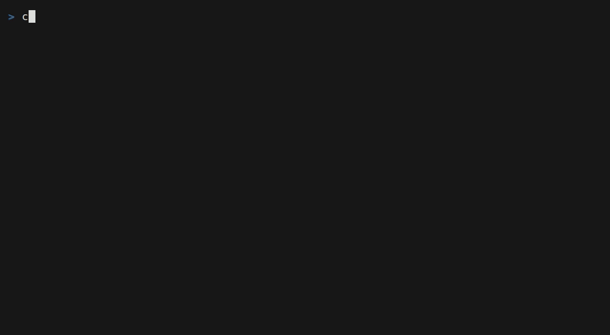

<div align="center">


# carrel

**A quiet place to read your markdown.**

</div>

> **carrel** *(n.)* — a small enclosure with a desk, built for one person to sit and read.
> First recorded in the 13th century in the cloister of Westminster Abbey; found in libraries ever since.

Carrel is a free and open-source markdown **reader**. Not an editor, not a workbench — a reading desk.
It opens showing you the documents around you, renders them properly, and has a search that actually works.

**Carrel is a terminal application today, and that is the only version that exists.** A native GTK4
GUI is planned, and the codebase is deliberately built so one can be added without rewriting the
core — but it is **not written yet**. There is no GUI build to download, no preview, and no date.
Everything below installs the terminal reader.

<div align="center">



</div>

> **Status: early, but it runs.** `carrel` shows you what is around you to read; `carrel FILE` opens
> a reader with vim motions, incremental search, and a resize that keeps your place. Syntax
> highlighting, tables, images and mermaid diagrams all render. See [Roadmap](#roadmap).

### Privacy

Carrel reads only the directory you point it at. The default is the directory you are standing in;
anything wider is a root you pick yourself from a visible list. It sends nothing anywhere — remote
images in documents are never fetched; they render as their alt text. The index it caches lives
under `$XDG_CACHE_HOME/carrel` and holds file paths and modification times, nothing else.

---

## Why

Carrel targets what terminal markdown readers mostly haven't shipped:

| | |
|---|---|
| **Search that survives reflow and resize** | Matches are byte offsets into the document, so the match set is bit-for-bit identical at any width and a highlight follows its text across a rewrap. Most readers lose or shift matches when the window resizes; carrel can't, by construction. The headline feature and the hardest part. |
| **A comfortable measure** | Prose caps at 90 columns and centres, instead of stretching a paragraph across a 200-column terminal. Tables, code and diagrams still use the whole width. |
| **A file-discovery home screen** | Open `carrel` and see what's around you to read, instead of needing a filename. |
| **Clickable links** | Real OSC 8 hyperlinks, with graceful degradation. |
| **Correct emoji and wide characters** | Measured per grapheme cluster, never per codepoint. |
| **Complete markdown** | CommonMark + GFM, footnotes, tables, definition lists, frontmatter, and LaTeX math as terminal box art. Every claim here is [a test](crates/carrel/tests/conformance.rs). |
| **A GUI, eventually** | Planned and designed for, **not yet built.** So that people who don't use terminals can read markdown too. |

## Install

**Installer script** (Linux x86_64/aarch64 — static musl included — and macOS):

```bash
curl --proto '=https' --tlsv1.2 -LsSf \
  https://github.com/VaHughes/carrel/releases/latest/download/carrel-installer.sh | sh
```

**Fedora** (43 and 44, x86_64 and aarch64):

```bash
sudo dnf copr enable vahughes/carrel
sudo dnf install carrel
```

**Cargo** (any platform with a Rust toolchain), or prebuilt via
[`cargo-binstall`](https://github.com/cargo-bins/cargo-binstall):

```bash
cargo install carrel        # builds from crates.io
cargo binstall carrel       # fetches the release binary
```

Prebuilt archives for every target are on the
[releases page](https://github.com/VaHughes/carrel/releases). AUR (`carrel`, `carrel-bin`)
is prepared but waiting on Arch: AUR account registration is closed while the Arch team
handles an ongoing supply-chain campaign against the repository. Distribution is a
first-class goal, not an afterthought — the
research was blunt about why: one of the best-featured terminal markdown renderers in
existence has **under a hundred stars**, because nobody can find it. In this niche,
packaging beats code.

**Open `.md` files from your file manager** (optional, Linux): install
[`contrib/carrel.desktop`](contrib/carrel.desktop) (it is also inside every release archive)
and make carrel your markdown handler *if you want it* — carrel never takes the default by
itself:

```bash
cp contrib/carrel.desktop ~/.local/share/applications/
xdg-mime default carrel.desktop text/markdown
```

Windows support is planned (the port is scoped and small); until it lands, no Windows binaries
are published rather than shipping ones that half-work.

## Pipe into it

Carrel is a pager for markdown:

```bash
gh pr view 128 | carrel
git show HEAD:README.md | carrel
an-agent --stream | carrel     # content appears as it arrives
```

`carrel -` forces stdin mode, and `cmd | carrel - pattern` prints a match report. Piping
*out* still produces plain text, so `cmd | carrel | grep` behaves. While a producer is
still writing, the reader is already open — and your position and search matches hold as
content arrives, because positions never depend on the screen.

## Configuration

Optional. Carrel writes `$XDG_CONFIG_HOME/carrel/config` (or `~/.config/carrel/config`) itself
when you change a setting in the app, and you can edit it by hand. One `key = value` per line;
unknown keys and `#` comments are ignored.

| Key | Default | What it does |
|---|---|---|
| `max_width` | `90` | The reading measure: prose wraps at this many columns and centres on the page. Tables, code blocks, images and diagrams ignore it and use the full width. Set `0` to turn it off and let prose fill the terminal. |
| `theme` | `terminal` | Palette name — the default inherits your terminal's own colours. `T` cycles all 17 in the app and saves your choice. |
| `hints` | `true` | The lamplight hint row along the bottom. `H` toggles it. |
| `root` | — | The directory the home screen lists. `d` picks one in the app. |

```ini
# ~/.config/carrel/config
max_width = 72
theme = paper
```

## Build from source

Requires Rust 1.90+.

```bash
git clone https://github.com/VaHughes/carrel
cd carrel
cargo test --workspace
cargo run -p carrel -- README.md "search"
```

## Architecture

Two crates, one seam.

```
carrel-core/   document model, search, layout primitives.  NO UI DEPENDENCIES, EVER.
carrel/        the terminal frontend (ratatui).  the only frontend that exists today.
```

A GTK4 + WebKitGTK frontend is intended to sit *alongside* `carrel/`, never inside it. None of it
is written — what exists today is the discipline that keeps it possible: `carrel-core` has no UI
dependency, emits semantic scopes rather than ANSI, and exposes no width-dependent type. Every
project surveyed during research that planned a second frontend for "later" never got one, so
those constraints are treated as load-bearing rather than aspirational.

Everything follows from a single invariant:

> There is exactly one authoritative coordinate space: a byte offset into a flattened, unwrapped
> display text. Screen row, wrap column, and highlight rectangle are *derived* functions of
> `(document, width)` — recomputed on resize, never stored. A search hit recorded at width 80 is
> bit-for-bit the same value at width 40.

Search state therefore cannot be invalidated by reflow, because no search state is ever expressed in
display coordinates. Four independent implementations converge on this — Helix's entire terminal
resize handler updates a `Rect`, and VS Code's find feature has *no* wrap-change handler at all.

The rules that keep the second frontend possible are enforced mechanically:

```bash
./scripts/check-discipline.sh
```

## Roadmap

- [x] Workspace, document model, provenance table
- [x] Search over flattened display text — survives reflow by construction
- [x] Grapheme-correct width measurement and greedy line breaking
- [x] The real reflow layer — two-stage break-unit producer and packer
- [x] The TUI: view state, resize path, paint loop, vim motions, incremental search
- [x] File-discovery home screen with a cached index
- [x] OSC 8 hyperlinks, relative-link traversal with a history stack
- [x] Syntax highlighting (syntect, semantic scopes not colours)
- [x] Images (kitty protocol first, half-block fallback everywhere)
- [x] Themes: 17 palettes, cycled live, persisted
- [x] Help overlay, reading-position resume, `[[wikilinks]]`
- [x] Mouse selection that copies clean text (drag, double-click word, triple-click block)
- [x] Outline navigation, live reload, search inside every file
- [x] Mermaid diagrams as Unicode box art
- [x] Frontmatter cards, definition lists, LaTeX math as box art, a conformance suite
- [x] The reading desk begins: a 90-column measure with centred prose, a time-remaining
      estimate, and a home screen you can click
- [x] stdin/pager mode — pipe in, stream as it arrives, keep your place
- [x] Packaging: Fedora COPR, the shell installer, crates.io
- [ ] Packaging, remaining: AUR (blocked on Arch), Homebrew, `.deb`, winget
- [ ] The GUI: GTK4 shell + WebKitGTK content view — **not started, no date**

## Contributing

See [CONTRIBUTING.md](CONTRIBUTING.md). The short version: contributions are welcome inside the
one-coordinate-space invariant above, and `./scripts/check-discipline.sh` is the referee.

## License

MIT OR Apache-2.0, at your option.
